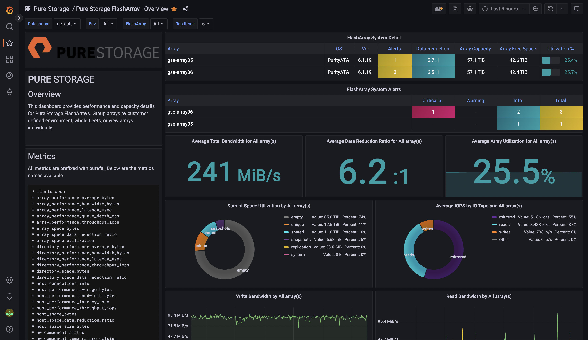

# Pure Storage FlashArray OpenMetrics exporter
OpenMetrics exporter for Pure Storage FlashArray.

## Support Statement
This exporter is provided under Best Efforts support by the Pure Portfolio Solutions Group, Open Source Integrations team.
For feature requests and bugs please use GitHub Issues.
We will address these as soon as we can, but there are no specific SLAs.
##

### Overview

This application aims to help monitor Pure Storage FlashArrays by providing an "exporter", which means it extracts data from the Purity API and converts it to the OpenMetrics format, which is for instance consumable by Prometheus, or other observability platforms.

The stateless design of the exporter allows for easy configuration management as well as scalability for a whole fleet of Pure Storage arrays. The design follows almost completely the [multi-target-exporter](https://prometheus.io/docs/guides/multi-target-exporter/) pattern described in the Prometheus documentation, so the tool can be used to scrape multiple FlashArrays from a single instance or just act the front-end for a single FlashArray.

To monitor your Pure Storage appliances, you will need to create a new dedicated user on your array, and assign read-only permissions to it. Afterwards, you also have to create a new API key.


### Building and Deploying

The exporter is a Go application based on the Prometheus Go client library and [Resty](https://github.com/go-resty/resty), a simple but reliable HTTP and REST client library for Go . It is preferably built and launched via Docker. You can also scale the exporter deployment to multiple containers on Kubernetes thanks to the stateless nature of the application.

---

#### The official docker images are available at Quay.io

```shell
docker pull quay.io/purestorage/pure-fa-om-exporter:<release>
```

where the release tag follows the semantic versioning.

---

#### Binaries

Binary downloads of the exporter can be found on the [Releases](https://github.com/PureStorage-OpenConnect/pure-fa-openmetrics-exporter/releases/latest) page.

---
### Local development

The following commands describe how to run a typical build :
```shell

# clone the repository
git clone git@github.com:PureStorage-OpenConnect/pure-fa-openmetrics-exporter.git

# modify the code and build the package
cd pure-fa-openmetrics-exporter
...
make build

```

The newly built exporter executable can be found in the <kbd>./out/bin</kbd> directory.

### Docker image

The provided dockerfile can be used to generate a docker image of the exporter. The image can be built using docker as follows

```shell

VERSION=<version>
docker build -t pure-fa-ome:$VERSION .
```


### Authentication

Authentication is used by the exporter as the mechanism to cross authenticate to the scraped appliance, therefore for each array it is required to provide the REST API token for an account that has a 'readonly' role. The api-token can be provided in two ways

- using the HTTP Authorization header of type 'Bearer', or
- via a configuration map in a specific configuration file.

The first option requires to specify the api-token value as the authorization parameter of the specific job in the Prometheus configuration file.
The second option provides the FlashArray/api-token key-pair map for a list of arrays in a simple YAML configuration file that is passed as paramether to the exporter. This makes possible to write more concise Prometheus configuration files and also to configure other scrapers that cannot use the HTTP authentication header.

### Usage

```shell

usage: pure-fa-om-exporter [-h|--help] [-a|--address "<value>"] [-p|--port <integer>] [-d|--debug] [-t|--tokens <file>]

                           Pure Storage FA OpenMetrics exporter

Arguments:

  -h  --help     Print help information
  -a  --address  IP address for this exporter to bind to. Default: 0.0.0.0
  -p  --port     Port for this exporter to listen. Default: 9490
  -d  --debug    Enable debug. Default: false
  -t  --tokens   API token(s) map file
```

The array token configuration file must have to following syntax:

```shell
<array_id1>:
  address: <ip-address>|<hosname1>
  api_token: <api-token1> 
<array_id2>:
  address: <ip-address2>|<hostname2>
  api_token: <api-token2>
...
<array_idN>:
  address: <ip-addressN>|<hostnameN>
  api_token: <api-tokenN>
```  

### Scraping endpoints

The exporter uses a RESTful API schema to provide Prometheus scraping endpoints.


| URL                                                   | GET parameters | Description              |
| ----------------------------------------------------- | -------------- | ------------------------ |
| http://\<exporter-host\>:\<port\>/metrics             | endpoint       | Full array metrics       |
| http://\<exporter-host\>:\<port\>/metrics/array       | endpoint       | Array only metrics       |
| http://\<exporter-host\>:\<port\>/metrics/volumes     | endpoint       | Volumes only metrics     |
| http://\<exporter-host\>:\<port\>/metrics/hosts       | endpoint       | Hosts only metrics       |
| http://\<exporter-host\>:\<port\>/metrics/pods        | endpoint       | Pods only metrics        |
| http://\<exporter-host\>:\<port\>/metrics/directories | endpoint       | Directories only metrics |


Depending on the target array, scraping for the whole set of metrics could result into timeout issues, in which case it is suggested either to increase the scraping timeout or to scrape each single endpoint instead.

### Prometheus configuration

A sample of a basic configuration file for Prometheus is as follows.

```shell

global:
  scrape_interval: 30s
  scrape_timeout: 10s
  evaluation_interval: 30s
scrape_configs:
- job_name: monitoring/pure-fa-probe
  honor_timestamps: true
  scrape_interval: 30s
  scrape_timeout: 10s
  metrics_path: /metrics/pods
  scheme: http
  follow_redirects: true
  enable_http2: true
  relabel_configs:
  - source_labels: [job]
    separator: ;
    regex: (.*)
    target_label: __tmp_prometheus_job_name
    replacement: $1
    action: replace
  - separator: ;
    regex: (.*)
    target_label: job
    replacement: pure-fa-probe
    action: replace
  - source_labels: [__address__]
    separator: ;
    regex: (.*)
    target_label: __param_target
    replacement: $1
    action: replace
  - source_labels: [__param_target]
    separator: ;
    regex: (.*)
    target_label: instance
    replacement: $1
    action: replace
  - separator: ;
    regex: (.*)
    target_label: __address__
    replacement: pure-fa-exporter.your.domain:9490  #  <== your exporter address and port goes here
    action: replace
  static_configs:
  - targets:           #  <== the list of your flasharrays goes here
    - 10.11.12.80
    - 10.11.12.82
    - 10.11.12.90

```

See the kubernetes [examples](examples/config/k8s) for a similar configuration that uses a the additional config for a simple Prometheus kubernets deploymemt or the more interesting Prometheus operator.

### Usage examples

#### Docker 
In a typical production scenario, it is recommended to use a visual frontend for your metrics, such as [Grafana](https://github.com/grafana/grafana). Grafana allows you to use your Prometheus instance as a datasource, and create Graphs and other visualizations from PromQL queries. Grafana, Prometheus, are all easy to run as docker containers.

To spin up a very basic set of those containers, use the following commands:
```bash
# Pure exporter
docker run -d -p 9490:9490 --name pure-fa-om-exporter quay.io/purestorage/pure-fa-om-exporter:<version>

# Prometheus with config via bind-volume (create config first!)
docker run -d -p 9090:9090 --name=prometheus -v /tmp/prometheus-pure.yml:/etc/prometheus/prometheus.yml -v /tmp/prometheus-data:/prometheus prom/prometheus:latest

# Grafana
docker run -d -p 3000:3000 --name=grafana -v /tmp/grafana-data:/var/lib/grafana grafana/grafana
```
Please have a look at the documentation of each image/application for adequate configuration examples.

#### Kubernetes

A simple but complete example to deploy a full monitoring stack on Kubernetes can be found in the [examples](examples/config/k8s) directory

#### Docker Compose

A complete example monitoring stack implemented in Docker Compose which can be found in the [examples](examples/config/docker) directory. 

### Metrics Collected


Please refer to the [purefa metrics specification](specification/metrics/purefa-metrics.md) for full details about all metrics.

| Metric Name                                          | Description                                                    |
| ---------------------------------------------------- | -------------------------------------------------------------- |
| purefa_info                                          | FlashArray system information                                  |
| purefa_alerts_open                                   | FlashArray open alert events                                   |
| purefa_array_performance_average_bytes               | FlashArray array average operations size in bytes              |
| purefa_array_performance_bandwidth_bytes             | FlashArray array throughput in bytes per second                |
| purefa_array_performance_latency_usec                | FlashArray array latency in microseconds                       |
| purefa_array_performance_queue_depth_ops             | FlashArray array queue depth size                              |
| purefa_array_performance_throughput_iops             | FlashArray array throughput in iops                            |
| purefa_array_space_bytes                             | FlashArray array space in bytes                                |
| purefa_array_space_data_reduction_ratio              | FlashArray array space data reduction                          |
| purefa_array_space_utilization                       | FlashArray array space utilization in percent                  |
| purefa_directory_performance_average_bytes           | FlashArray directory average operations size in bytes          |
| purefa_directory_performance_bandwidth_bytes         | FlashArray directory throughput in bytes per second            |
| purefa_directory_performance_latency_usec            | FlashArray directory latency in microseconds                   |
| purefa_directory_performance_throughput_iops         | FlashArray directory throughput in iops                        |
| purefa_directory_space_bytes                         | FlashArray directory space in bytes                            |
| purefa_directory_space_data_reduction_ratio          | FlashArray directory space data reduction                      |
| purefa_host_connections_info                         | FlashArray host volumes connections                            |
| purefa_host_performance_average_bytes                | FlashArray host average operations size in bytes               |
| purefa_host_performance_bandwidth_bytes              | FlashArray host bandwidth in bytes per second                  |
| purefa_host_performance_latency_usec                 | FlashArray host latency in microseconds                        |
| purefa_host_performance_throughput_iops              | FlashArray host throughput in iops                             |
| purefa_host_space_bytes                              | FlashArray host space in bytes                                 |
| purefa_host_space_data_reduction_ratio               | FlashArray host space data reduction                           |
| purefa_host_space_size_bytes                         | FlashArray host volumes size                                   |
| purefa_hw_component_status                           | FlashArray hardware component status                           |
| purefa_hw_component_temperature_celsius              | FlashArray hardware component temperature in C                 |
| purefa_hw_component_voltage_volt                     | FlashArray hardware component voltage                          |
| purefa_network_interface_performance_bandwidth_bytes | network interfaces bandwidth in bytes per second               |
| purefa_network_interface_performance_throughput_pkts | FlashArray network interfaces throughput in packets per second |
| purefa_network_interface_performance_errors          | FlashArray network interfaces errors per second                |
| purefa_pod_performance_average_bytes                 | FlashArray pod average operations size                         |
| purefa_pod_performance_bandwidth_bytes               | FlashArray pod throughput in bytes per second                  |
| purefa_pod_performance_latency_usec                  | FlashArray pod latency in microseconds                         |
| purefa_pod_performance_throughput_iops               | FlashArray pod throughput in iops                              |
| purefa_pod_space_bytes                               | FlashArray pod space in bytes                                  |
| purefa_pod_space_data_reduction_ratio                | FlashArray pod space data reduction                            |
| purefa_pod_performance_replication_bandwidth_bytes   | FlashArray pod replication bandwidth in bytes per second       |
| purefa_pod_replica_links_performance_bandwidth_bytes | FlashArray pod replica links throughput in bytes per second    |
| purefa_pod_replica_links_lag_average_sec             | FlashArray pod replica links average lag in seconds            |
| purefa_pod_replica_links_lag_max_sec                 | FlashArray pod replica links maximum lag in seconds            |
| purefa_volume_performance_average_bytes              | FlashArray volume average operations size in bytes             |
| purefa_volume_performance_bandwidth_bytes            | FlashArray volume throughput in bytes per second               |
| purefa_volume_performance_latency_usec               | FlashArray volume latency in microseconds                      |
| purefa_volume_performance_throughput_iops            | FlashArray volume throughput in iops                           |
| purefa_volume_space_bytes                            | FlashArray volume space in bytes                               |
| purefa_volume_space_data_reduction_ratio             | FlashArray volume space data reduction                         |


## Monitoring On-Premise with Prometheus and Grafana
Take a holistic overview of your Pure Storage FlashArray estate on-premise with Prometheus and Grafana to summarize statistics such as:
  * FlashArray Utilization
  * Purity OS version
  * Data Reduction Rate
  * Number and type of open alerts

Drill down into specific arrays and identify top busy hosts while correlating read and write operations and throughput to quickly highlight or eliminate investigation enquiries.
<br>


<br>
For more information on dependencies, and notes to deploy -- take look at the examples for Grafana and Prometheus in the [extra/grafana/](extra/grafana/) and [extra/prometheus/](extra/prometheus/) folders respectively.

# License

This project is licensed under the Apache 2.0 License - see the [LICENSE](LICENSE) file for details.
