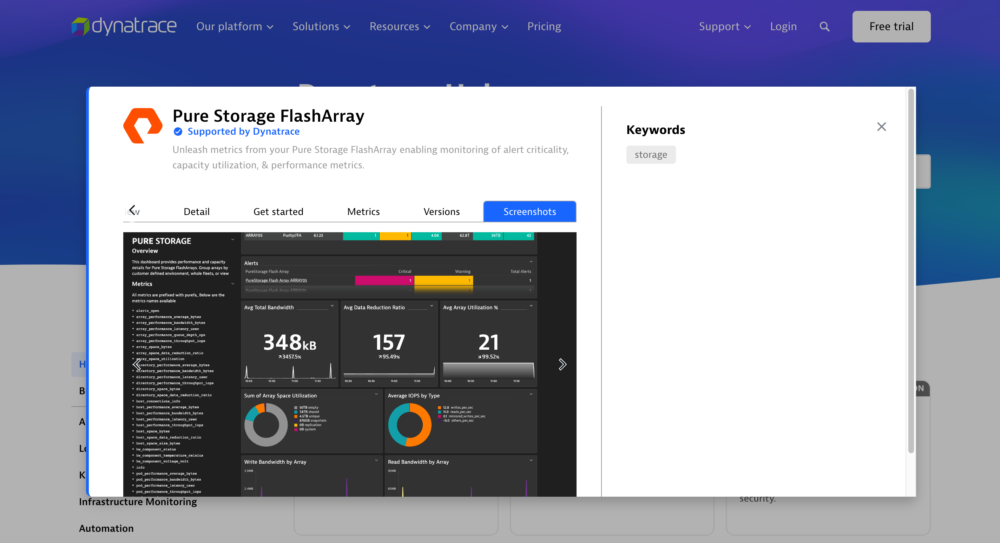
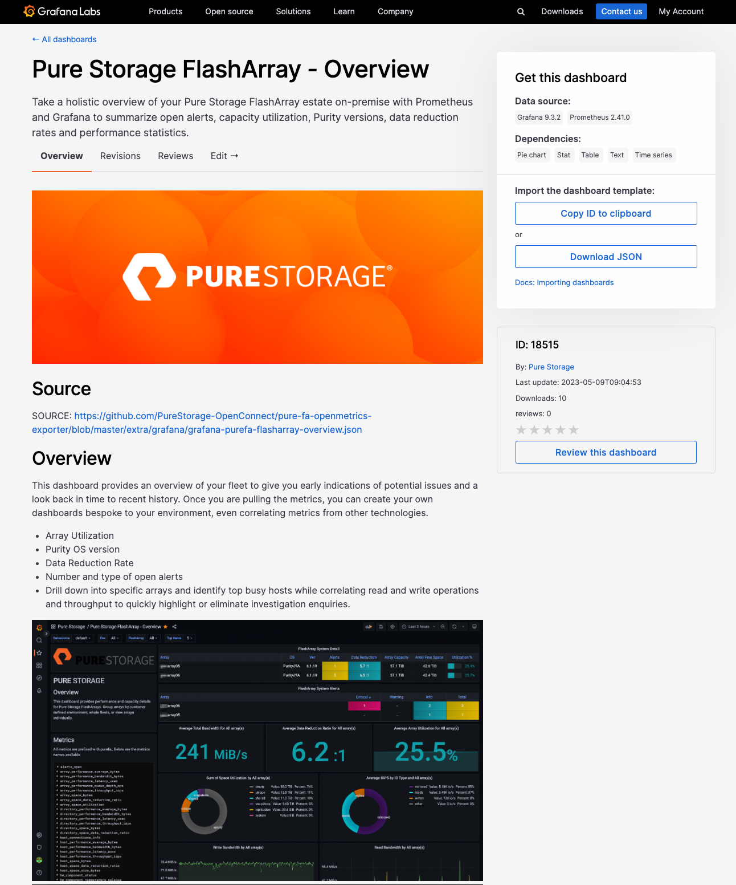

# Integrating with Observability Platforms

While most monitoring and observability platforms should be able to utilize the OpenMetrics standard, some platforms may require some form of minor config or development to integrate. This is normal for any device providing metrics, not just Pure Storage.

Pure Storage are working with observability platform vendors to ensure products work out of the box.

## Datadog

https://docs.datadoghq.com/integrations/purefa/

This check monitors the Pure Storage FlashArray through the Datadog Agent and the Pure Storage OpenMetrics exporter.

The integration can provide performance data at the array, host, volume and pod level, as well as high-level capacity and configuration information.

You can monitor multiple FlashArrays and aggregate these into a single dashboard, or group them together by customer defined environment.

 

 

### Local Wheel Install:
In [extra/datadog](datadog) we have a copy of the PureFA Datadog wheel install file available for download if you are unable to connect to Datadog's repository.

Please use the [Datadog docs](https://docs.datadoghq.com/developers/integrations/agent_integration/?tab=buildanoutoftheboxintegration#install-the-wheel) for assistance installing this to your Datadog agent. 

All other guidance listed in the [main integration documentation](https://app.datadoghq.com/integrations/purefa) remains the same.

## Dynatrace

https://www.dynatrace.com/hub/detail/pure-storage-flasharray

Dynatrace extension 2.0 automates metric ingestion and performance data correlation. With 2x dashboards included in the bundle, users can drill down through array configuration items and monitor a fleet of arrays providing an overview of capacity utilization, data reduction and Purity version.

 

 

## Grafana

https://grafana.com/grafana/dashboards/18515-pure-storage-flasharray-overview/

On-premise or cloud based monitoring solution with Prometheus and Grafana.

Take a holistic overview of your Pure Storage FlashArray estate on-premise with Prometheus and Grafana to summarize statistics such as:
  * FlashArray Utilization
  * Purity OS version
  * Data Reduction Rate
  * Number and type of open alerts

Drill down into specific arrays and identify top busy hosts while correlating read and write operations and throughput to quickly highlight or eliminate investigation enquiries.

For more information on dependencies, and notes to deploy -- take look at the examples for Grafana and Prometheus in the [extra/grafana/](grafana/) and [extra/prometheus/](prometheus/) folders respectively.

 

 
